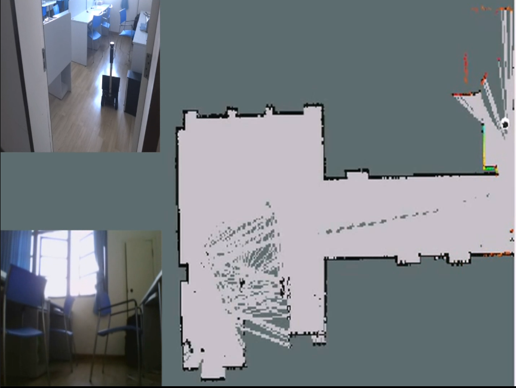

# rplidar_ros
The driver of RPLIDAR on Robot Operation System (ROS) 

`ROS` `C++` `mapping` `driver`

Indoor mapping with RPlidar and our own robots Carmela




**click [here](http://dwz.cn/rplidar_ros) to see the video.**

##Dependencies
---------------------
- ROS indigo 
- the simulator in your personal ROS directory,install commands:

```
$ sudo apt-get install ros-indigo-arbotix-*
```

##How to run the demo
---------------------

#### I. Build the project

	1. clone the project to your ROS catkin's workspaces src folder
	2. Run catkin_make to build the project

#### II. Run the roslaunch files
	1. roscore ( not necessary but run this command before is good habits)
	2. roslaunch aicroboxi_bringup fake_aicroboxi.launch
	3. roslaunch aicroboxi_bringup My_2dsensor.launch
	4. roslaunch aicroboxi_nav     hector_mapping_demo.launch
	5. roslaunch aicroboxi_rviz    view_navigation.launch

You should see the mapping in the rviz 

##Reference and acknowlegements
---------------------
- aicroboxi team. Mainly reference she yuan bo' [technical articles](http://my.phirobot.com/blog/2014-06-hector_mapping_example.html) 
- [hector-slam packages](https://github.com/tu-darmstadt-ros-pkg/hector_slam)
- [rplidar ROS packages](https://github.com/robopeak/rplidar_ros)

thanks to their contributions for ROS!